# Primary Vertex Identification

Identify the correct primary vertex from reconstructed tracks at the CMS Experiment using simulated data. The goal is to use the tracks from simulated data to predicate the location of the primary vertex at which they originated. This is done by training a Graph Convolutional Neural Network (GCNN) to be rewarded when the predicated vertex position from the tracks is close to the true vertex position.  

<!-- ## Quicklinks
- Paper:
- Presentation: -->

## Data

The data used is simulated data based on CMS data, created by `./utils/track_generator_clean.py`. The script generates simulated particle tracks based on known CMS physics distributions.

> All data is in .zip format and needs to be unzipped first.

1. **Input Processing:**
   - Takes input parameters like number of vertices and maximum tracks per vertex
   - Reads ROOT file containing histograms with real physics distributions
   - These distributions include: vertex Z positions, number of tracks per vertex, track pT and eta

2. **Core Functionality:**
   - Generates simulated primary vertices with positions sampled from the input distributions
   - For each vertex, creates a specific number of tracks with:
     - Track parameters (`pT`, `eta`) sampled from real physics distributions
     - Track uncertainties calculated based on eta (polar angle)
     - Track `z0` positions modified by resolution effects

3. **Output Generation:**
   - Creates JSON files containing the simulated track and vertex information
   - The JSON filenames have the format `events_{nVertices}V_{nTracksMax}T_{numTests}.json`.
   - Each output file describes an event containing:
     - List of vertices with their positions
     - For each vertex, list of tracks with:
       - `z0` position (track position at point of closest approach)
       - `dz0` (uncertainty on `z0`)

The script effectively creates realistic test data that mirrors actual particle detector measurements, useful for developing and testing track reconstruction algorithms.

To run `./utils/track_generator_clean.py`, check the following arguments

| Arguments    | Type | Default | Description |
| -------- | ------- | ------- | ------- |
| `nVertices` | Integer | `2` | The number of primary vertices in the event |
| `nTracksMax` | Integer | `5` | The maximum number of tracks per primary vertex |
| `numTests` | Integer | `1000` | Number of tests to run |
| `inputdir` | String | `"./datasets/"` | Where to find the `vertexInfo.root` file |
| `outputdir` | String | `"./datasets/train/set1"` | Where to save the output JSON files |

and then open a terminal in the project directory and execute the following command

```cmd
python ./utils/track_generator_clean.py --nVertices 2 --nTracksMax 5 --numTests 1000 --inputdir "./datasets/vertexInfo.root" --outputdir "./datasets/train/set1"
```

The data will be in the following tree directory

```text
datasets/
   ├── test/
   │   └── set1
   └── train/
      ├── set0
      └── set1
```

### Training Set

We use `./utils/track_generator_clean.py` to generate two different training sets:

- **The first set (`set0`)** has 49,000 different samples with a varying number of vertices and number of tracks per vertex.
  Specifically, we run the generator for

   ```py
   nVertices = [2, 3, 4, 5, 6, 7, 8]
   nTracksMax = [2, 3, 4, 5, 6, 7, 8]
   numTests = 1000
   ```

   Here are the details of the data generated

   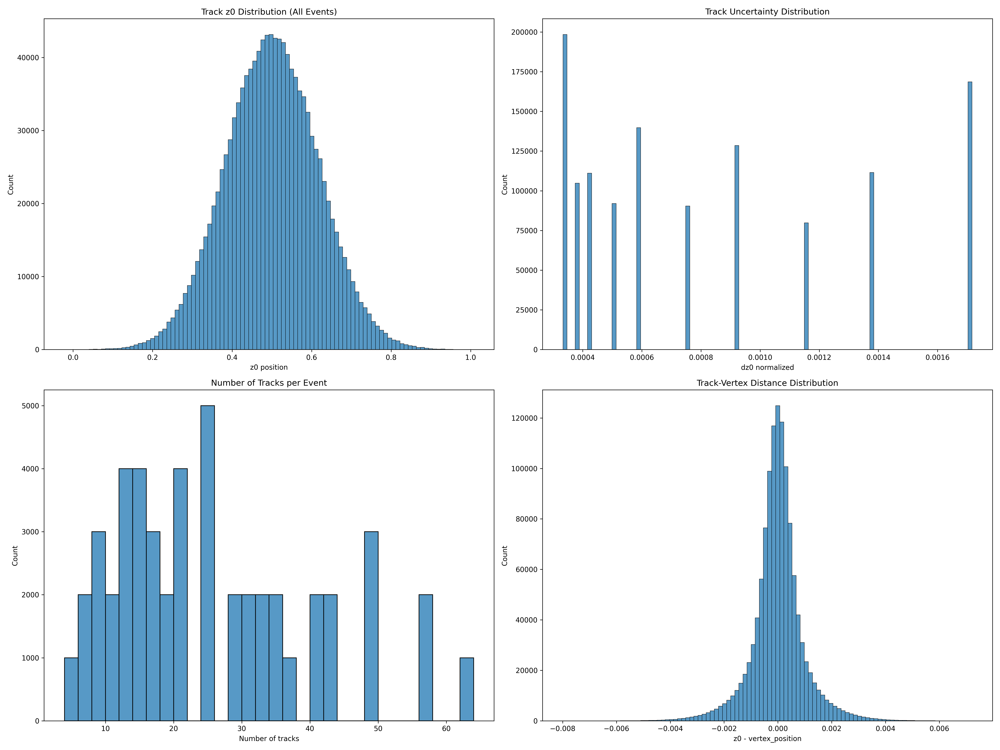

   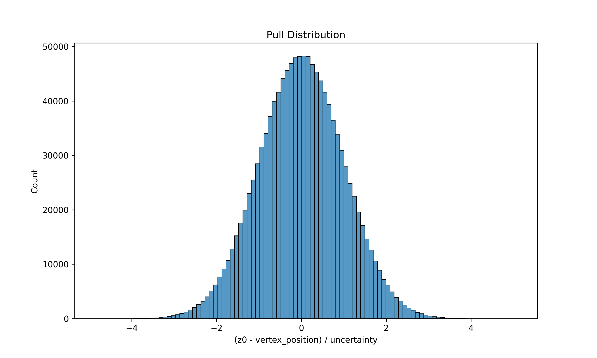

   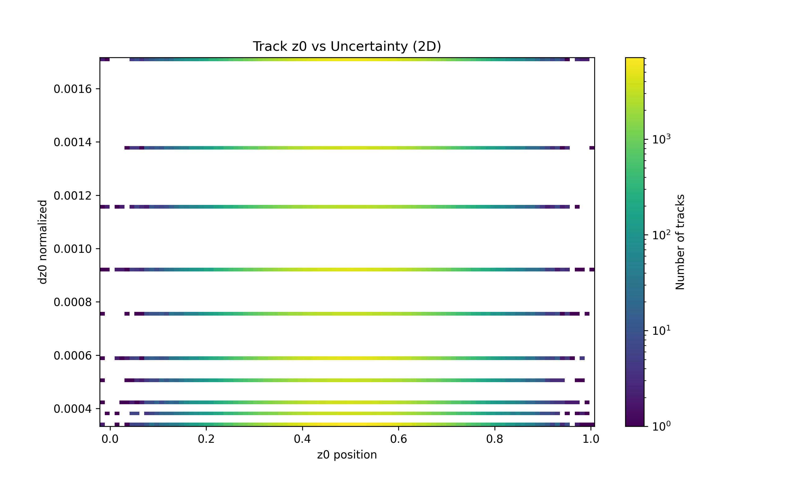

- **The second set (`set0`)** has 1,000 different samples with 60 vertices in each event and 10 tracks per vertex which is inspired by the data CMS produces, shown in the figure below. The following CMS diagram shows the mean number of interactions per crossing, which is essential the mean number of primary vertices per crossing.

   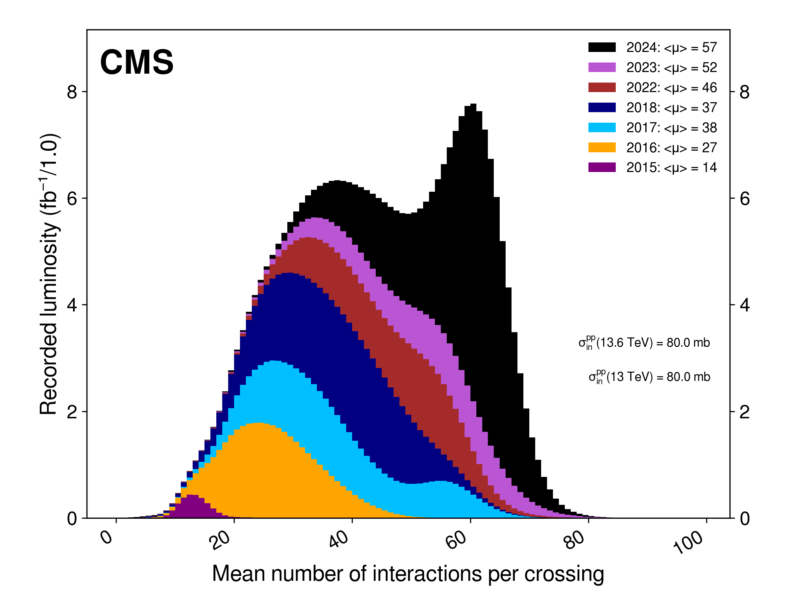

  To get a close dataset, we run the generator for

   ```py
   nVertices = 60
   nTracksMax = 10
   numTests = 1000
   ```

   for a total of 1,000 JSON files, having 60,000 vertices and 600,000 tracks in total.

   Here are the details of the data generated

   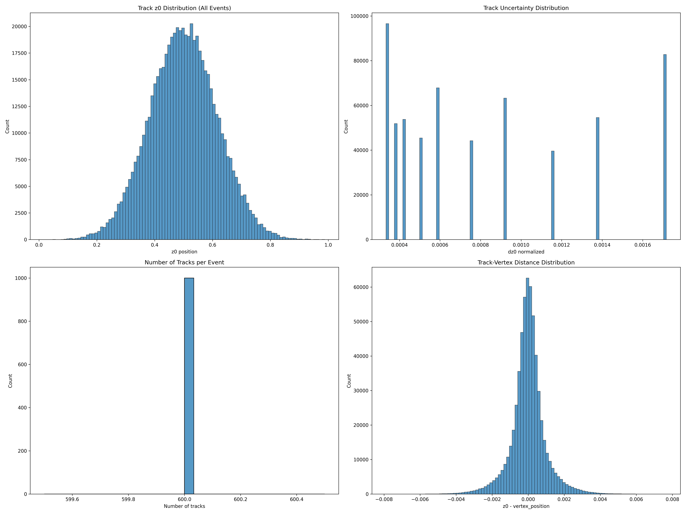

   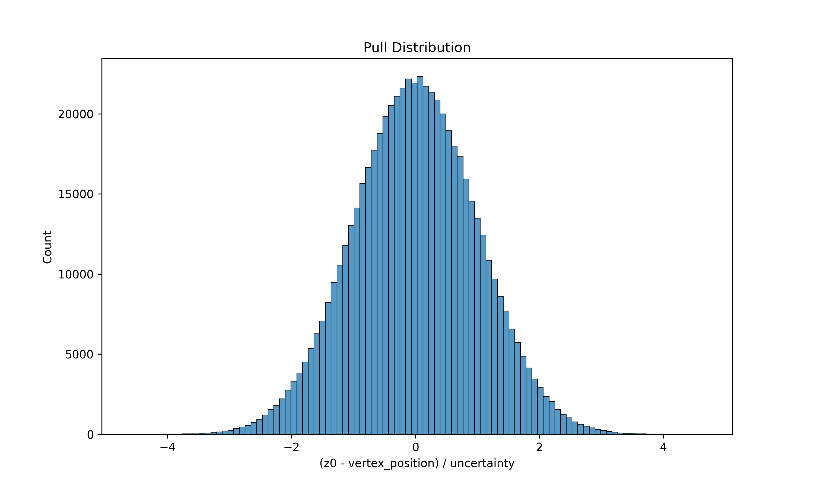

   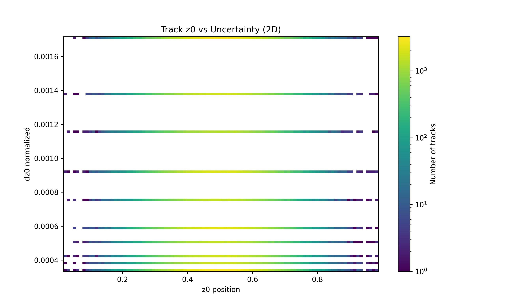

The pull distribution has a nice Gaussian form. For this specific dataset, the mean is and the standard deviation is.

Additionally, if we look closely, we can see the shortcomings of the track data generation: position and uncertainty are uncorrelated (probably not true) and uncertainty can take up only on a finite set of values.

The generated data files have the following structure

```py
[
    [vertex_position, # VERTEX 1
      [
        [track_z0, track_dz0_normalized], # TRACK 1
        [track_z0, track_dz0_normalized], # TRACK 2
        ...  # up to nTracksMax tracks
      ]
    ],
    ... # repeated nVertices times
]
```

To make running the generator easier, we run `./utils/run_track_generator.py` that executes the previous command multiple times for the different `nVertices` and `nTracksMax`. To do so, open the aforementioned file and edit the array of values and the save directory, then run

```terminal
python ./utils/run_track_generator.py
```

### Testing Set

To run the model on a test set which has realistic data, not only in values, but also in quantity, we generate another version of `set1`.

```terminal
python .\track_generator_clean.py --nVertices 60 --nTracksMax 10 --numTests 1 --output_dir "../datasets/test/set1"
```

## Model

The model directly predicts vertex $z$-positions with a physics-informed loss with chi-square track-vertex compatibility, where the track uncertainties (`dz0`) used for vertex position weighting.
<!-- - TBDDDDDDDDDD Clustering step to determine number of vertices -->

The `./src/model.py` file is described as follows:

1. `TrackDataset`: A custom PyTorch Geometric dataset class that
   - Takes a list of file paths containing track data as input
   - Processes JSON files containing vertex and track information
   - Creates graph objects for each vertex-track combination where:
     - **Nodes:** Track parameters `[z0, dz0_normalized]`
     - **Edges:** Connections between tracks with features `[distance, uncertainty_product]`
     - **Target:** The vertex position

2. `TrackConv`: A custom Graph Convolutional layer that
   - Inherits from PyTorch Geometric's MessagePassing class
   - Uses mean aggregation
   - Contains an MLP with:
     - Linear layer (`input_channels + 2` -> `output_channels`)
     - Layer normalization
     - GELU activation
     - Dropout
   - Has a residual connection

3. `VertexGNN`: The main Graph Neural Network model with
   - Initial node embedding layers:
     - Two Linear layers with `hidden_dim` size
     - Layer normalization and GELU activation after each
     - Dropout between layers

   - Multiple TrackConv layers (`num_layers`):
     - Each with `hidden_dim` size
     - Residual connections around each layer
     - Layer normalization after each layer

   - Final MLP for vertex prediction:
     - Linear(`hidden_dim` -> `hidden_dim`)
     - Layer normalization + ReLU + Dropout
     - Linear(`hidden_dim` -> `hidden_dim//2`)
     - Layer normalization + ReLU + Dropout  
     - Linear(`hidden_dim//2` -> `1`)

The model also includes a physics-based loss function that computes a chi-square value between the predicted vertex position and the track parameters.

This is a message-passing GNN architecture designed specifically for vertex finding, with node features representing track parameters and edge features capturing geometric relationships between tracks. The multiple layers allow the model to iteratively refine vertex position predictions through graph convolutions and message passing.

### Training

```text
# Initialize:
1. Create vertex dataset from track files
   - Load JSON files containing track parameters and vertex positions
   - Create graph objects with:
     * Nodes = tracks [z0, dz0_normalized] 
     * Edges = track pairs [distance, uncertainty_product]
     * Target = vertex position

2. Split data:
   - 70% train, 15% val, 15% test
   - Create DataLoaders with batch_size=32 (user changeable)

3. Setup model and training:
   - Initialize VertexGNN(hidden_dim=256, num_layers=5)
   - Adam optimizer with lr=1e-4
   - OneCycleLR scheduler
   - Early stopping with patience=300

# Training loop:
for epoch in range(50):
    # Training phase 
    model.train()
    for batch in train_loader:
        1. Forward pass:
           - Get vertex predictions from VertexGNN
           - Track parameters go through node embedding 
           - Multiple TrackConv layers with message passing
           - Final MLP predicts vertex position

        2. Compute losses:
           - Primary loss: MAE between predicted and true vertices
           - Physics loss: Chi-square between predicted vertex and track parameters  
           - Total loss = primary_loss + 0.1 * physics_loss

        3. Optimization:
           - Zero gradients
           - Backpropagate total loss
           - Optimizer step
           - Update LR scheduler

    # Validation phase
    model.eval()
    for batch in val_loader:
        1. Get predictions:
           - Forward pass without gradients
           - Store predicted vertices

        2. Calculate metrics:
           - Validation loss
           - Mean absolute error
           - Accuracy at different tolerances (1%)

    3. Checkpoint management:
       - Save if validation loss improves
       - Early stop if no improvement for patience epochs

# Final evaluation:
1. Load best model
2. Evaluate on test set:
   - Calculate test loss and MAE  
   - Save final results
   - Generate prediction plots
```

To run the training script, check the following arguments

| Arguments    | Type | Default | Description |
| -------- | ------- | ------- | ------- |
| `dataset` | String | Required | The name of the training run |
| `data_dir` | String | Required | The directory of the JSON files generated by the track generator |
| `hidden_dim` | Integer | `256` | The number of hidden dimensions to be added in the model architecture |
| `num_layers` | Integer | `6` | The number of convolutional layers embedded in the model architecture |
| `dropout` | Integer | `0.05` | The dropout rate |
| `epochs` | Integer | `100` | The number of epochs |
| `batch_size` | Integer | `64` | The batch size for the training loop |
| `learning_rate` | Integer | `1e-5` | The maximum learning rate for the Adam optimizer (varies during training) |
| `weight_decay` | Integer | `1e-5` | The decay rate of the learning rate |
| `patience` | Integer | `50` | The number of epochs to stop training if a condition on the loss is met |

and then open a terminal in the project directory and execute the following command

```text copy=True
python ./src/train.py --dataset INSERT_TITLE --data_dir INSERT_OUTPUT_DIR --hidden_dim 256 --num_layers 6 --dropout 0.05 --epochs 100 --batch_size 64 --learning_rate 0.00001
```

After running this for the parameters for the two datasets separately, we have

- **The first set (`set0`):** The model is stored in `./trained_models/set0_hd256_nl6_e100_bs64_lr1e-05_wd1e-05_d0.05.pt`. The validation scatter plot and training metric are given here.

   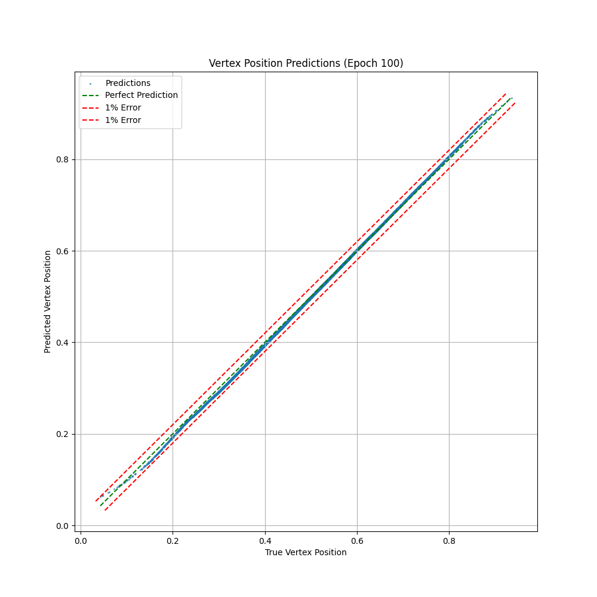

   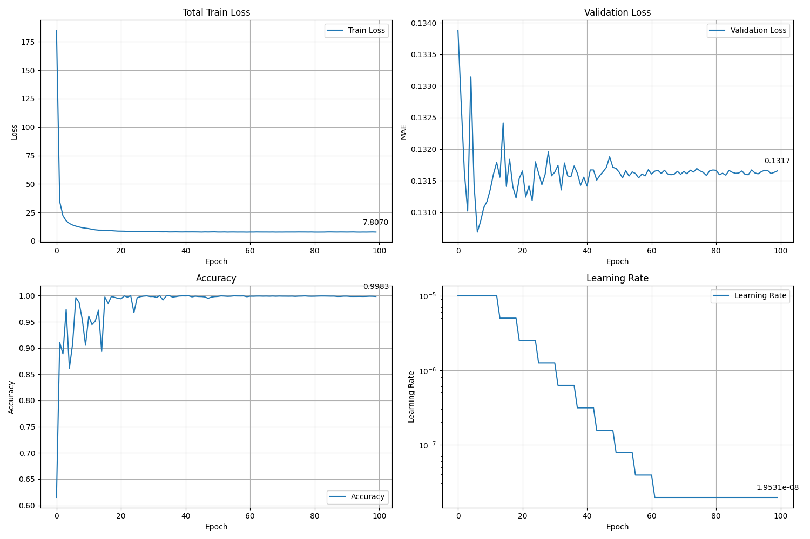

- **The second set (`set1`):** The model is stored in `./trained_models/set1_hd256_nl6_e100_bs64_lr1e-05_wd1e-05_d0.05.pt`. The validation scatter plot and training metric are given here.

   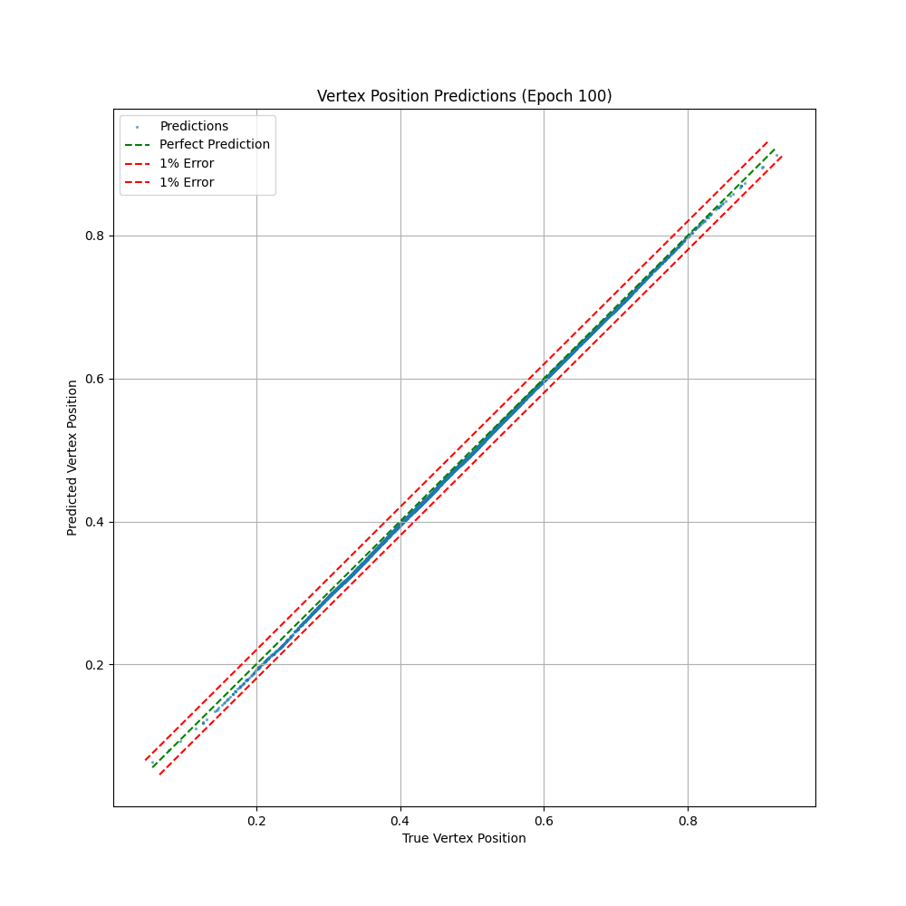

   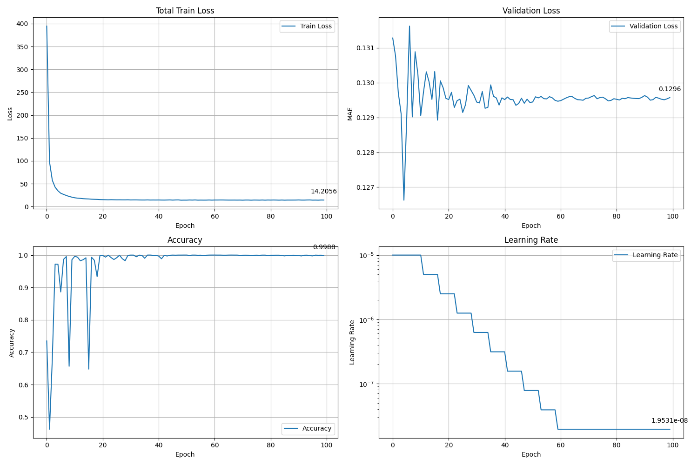

As a remark, the points in the graph above are extremely dense since, if you recall, the training sets had a lot of vertices and tracks per vertex. Additionally, we can see how the density tapers off on the sides, which represents the Gaussian pull distribution.

## Testing

To test our models, simply run

```terminal
python ./src/test.py --model_dir ../trained_models --model_name set0_hd256_nl6_e100_bs64_lr1e-05_wd1e-05_d0.05 --data_dir ../datasets/test/set1  --data_set set1
```

and then the output directory will be in `./src/test/set0`, where `set0` here refers to the dataset the model was tested on, not the test set name.

We take the two model files generated above, stored at `./trained_models/` and run the test dataset through them.

- **The first model trained on `set0`:** The analysis of this model gives an average of 99.81% of predictions being within 1% error.

   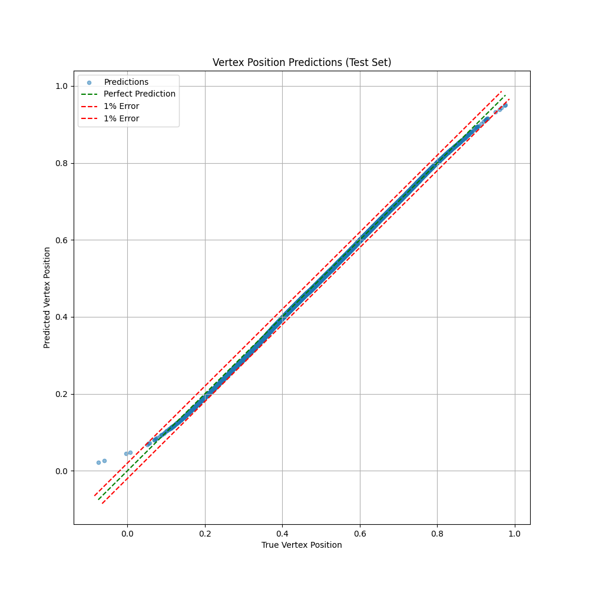

   ```text
   test_loss: 0.13108545241355896
   mae: 8.387040843200683
   rmse: 0.0036350178997963667
   accuracy: 0.9980833333333333
   model_config: {'hidden_dim': 256, 'num_layers': 6, 'epochs': 100, 'batch_size': 64, 'learning_rate': '1e-05', 'weight_decay': '1e-05', 'dropout': 0.05}
   ```

- **The first model trained on `set1`:** The analysis of this model gives an average of 97.25% of predictions being within 1% error.

   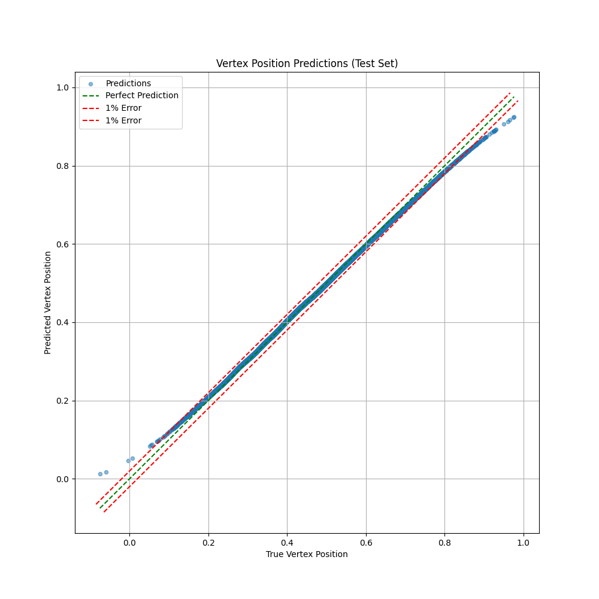
   
   ```text
   test_loss: 0.13108545241355896
   mae: 8.387040843200683
   rmse: 0.0036350178997963667
   accuracy: 0.9980833333333333
   model_config: {'hidden_dim': 256, 'num_layers': 6, 'epochs': 100, 'batch_size': 64, 'learning_rate': '1e-05', 'weight_decay': '1e-05', 'dropout': 0.05}
   ```

## Comparison with Deterministic Annealing

In the folder `./deterministic_annealing`, the file `DeterministicAnnealing.cc` is taken from [Purdue-TOP/PrimaryVertexing](https://github.com/Purdue-TOP/PrimaryVertexing/blob/master/src/vertexers/DeterministicAnnealer.cc) but modified to our needs.

After running `g++ DeterministicAnnealer.cc -o DeterministicAnnealing` to compile the C++ code into an .exe file, the program runs and outputs a `serializableResponse.json` file, contained in `./deterministic_annealing`.

We will use `serializableResponse.json` in addition to the generated `serializedEvents.json` file from `.utils/track_generator_clean.py` to compare how well this deterministic annealing algorithm performs. The reason is to have a "classical" solution to the problem of vertex assignment that we can use for comparison with our model's performance.

We now run `./deterministic_annealing/deterministic_annealer_analysis.py` to check the predictions from the deterministic annealer in comparison to the true values. This executable will create as many JSON files and plots as there are events. For example, here is what one looks like:

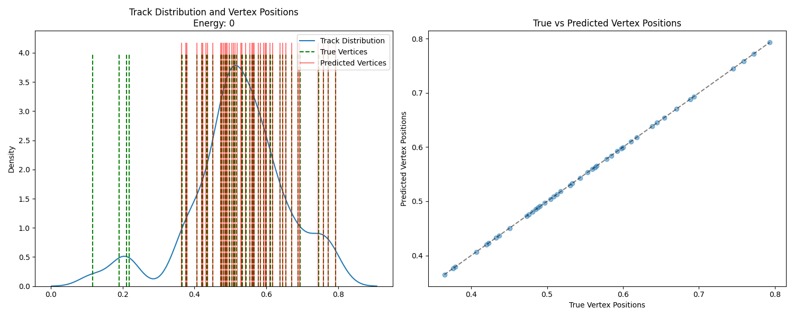

The analysis of the deterministic annealer gives an average of 97.25% of preductions being within 1% error.

## Future Considerations

As we require more accuracy, the machine learning model falls off faster than the deterministic annealer. Hence, model architecture should be worked on for the next version of this model. From that, we can say that there definitely is more work to be done, and those approaches include:

- Experimenting with different models, specifically, one suggestion might be a transformer encoder to decoder structure
- Using real data and fully incorporating the track information like `pT`, `eta`, `phi`, `d0`, and `z0`, within uncertainties
- Using quantum annealing to benchmark

## References

[1] [https://phys.org/news/2024-09-lhc-luminosity.html](https://phys.org/news/2024-09-lhc-luminosity.html)
[2] [https://iopscience.iop.org/article/10.1088/1742-6596/110/9/092009/pdf](https://iopscience.iop.org/article/10.1088/1742-6596/110/9/092009/pdf)
[3] [https://www.slideserve.com/dbernal/vertex-and-track-reconstruction-in-cms-powerpoint-ppt-presentation](https://www.slideserve.com/dbernal/vertex-and-track-reconstruction-in-cms-powerpoint-ppt-presentation)
[4] [https://opendata.cern.ch/](https://opendata.cern.ch/)
[5] [https://www.lhc-closer.es/taking_a_closer_look_at_lhc/0.lhc_p_collisions](https://www.lhc-closer.es/taking_a_closer_look_at_lhc/0.lhc_p_collisions)
[6] Pattern Recognition, Tracking and Vertex Reconstruction in Particle Detectors by Rudolf Frühwirth and Are Strandlie
[7] [https://www.youtube.com/watch?v=pLcVVwx4tcw](https://www.youtube.com/watch?v=pLcVVwx4tcw)
[8] [https://indico.cern.ch/event/870237/](https://indico.cern.ch/event/870237/)
[9] [https://twiki.cern.ch/twiki/bin/view/CMSPublic/LumiPublicResults#Run_3_charts_of_luminosity](https://twiki.cern.ch/twiki/bin/view/CMSPublic/LumiPublicResults#Run_3_charts_of_luminosity)
